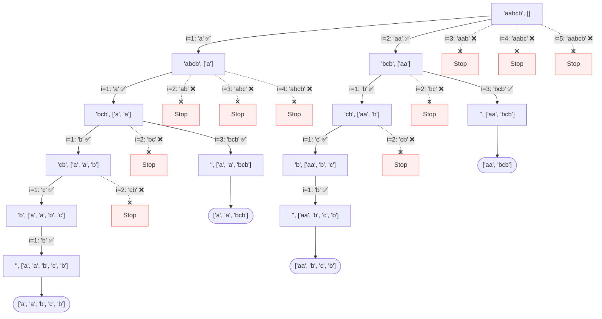

# 131. Palindrome Partitioning: The "String Cutting" Logic

Understanding Palindrome Partitioning is much easier when you stop thinking about "backtracking" as a complex abstract concept and start thinking about it as **cutting a piece of string**.

---

## 1. The Base Case: Why does Empty String mean Success?

The code starts with: `if not s: result.append(path)`. This is the **"Mission Accomplished"** signal.

### The Problem: "Total Consumption"
In this problem, the goal isn't just to find *any* palindromes; it is to **completely partition the entire string**.

### The Analogy: Eating a Baguette
Imagine you are given a long baguette (the string). You are only allowed to take a bite if that piece is "tasty" (a palindrome).

- **Success:** You keep taking tasty bites until there is **nothing left** in your hands (`s` is empty). This means every single crumb of that baguette was part of a tasty palindromic bite. You record this as a "Successful Meal."
- **Failure (Dead End):** You have a small piece left in your hand, but it’s just a plain crust that isn't tasty (not a palindrome). You can't take another bite, but you still have bread left! This meal was a failure, so you don't record it.

### Bottom Line:
If `s` is empty, it means you successfully "processed" every character of the original string by splitting it into palindromes. If you stop because you can't find any more palindromes but `s` still has letters, that branch is discarded.

---
Imagine you have a string `"aabcb"`. Your goal is to cut it into pieces such that **every piece is a palindrome**.

### The Split Point `i`: "Where do I cut?"
In the code, `i` is the length of the piece you are currently trying to cut off from the left.
- If `i = 1`, you cut off the first character.
- If `i = 2`, you cut off the first two characters.

### The `path`: "What have I collected?"
`path` is your **basket**. Every time you make a cut and find it's a palindrome, you put that piece into your basket and move on to the rest of the string.

---

## 2. Python Mystery: Original List vs. New List

This is the "Secret Sauce" of the algorithm. To understand why we do `path + [prefix]`, you have to understand the difference between **modifying a list** and **creating a new one**.

### The Analogy: The Paper vs. The Photocopy

Imagine you have a piece of paper (a list) with some notes on it.

#### Option A: `path.append("a")` (Modifying the original)
- This is like taking a pen and writing "a" on your **original** piece of paper.
- **Problem:** If you realize you made a mistake and want to go back, you have to find an eraser and erase it. If you forget to erase it, every other part of your code sees your mistake!

#### Option B: `path + ["a"]` (Creating a new list)
- This is like taking your paper to a **photocopy machine**. You make a copy, and then you write "a" on the **copy**.
- **Result:** You now have two pieces of paper. The original is untouched, and the copy has the new info.
- **The Magic:** When our code "returns" (backtracks) to a previous step, it simply goes back to using the **original paper**. It doesn't have to "erase" anything because the original was never changed!

### Why is this important?
Backtracking requires us to try many different paths. If we "mess up" the original `path` by appending to it, we have to remember to "clean up" (pop) after ourselves. By creating a **new list** at every step, the cleanup happens automatically.

| Code | Type | Effect on `path` | Automates Backtracking? |
| :--- | :--- | :--- | :--- |
| `path.append(x)` | **Mutation** | Changes the original list in place. | No (requires manual `pop`) |
| `path + [x]` | **Creation** | Leaves original alone, creates a new list. | **Yes!** (The "undo" is built-in) |

---

## 3. The Magic of "Returning": The Adventure Game Analogy

When we say the code **"returns"** or **"backtracks,"** think of playing a video game with **Automatic Save Points**.

### The Scenario: `s = "aab"`

1. **The Crossroads (Level 1 - call 1):**
   - You are at a crossroads. Your bag (`path`) is **Empty**.
   - **Save Point Alpha:** The game automatically saves your state: `[Empty Bag]`.
   - You decide to take path `i=1`: Pick up a **Red Gem** (`"a"`).
   - You walk through a portal to the next level.

2. **The Forest (Level 2 - call 2):**
   - You are now in the Forest. Your bag has `[Red Gem]`.
   - **Save Point Beta:** The game saves your state: `[Red Gem]`.
   - You decide to take path `i=1`: Pick up a **Green Gem** (`"a"`).
   - You walk through a portal to the next level.

3. **The Cave (Level 3 - call 3):**
   - You are in the Cave. Your bag has `[Red Gem, Green Gem]`.
   - You find the last piece: **Blue Gem** (`"b"`).
   - **VICTORY!** You record the combination: `[Red, Green, Blue]`.

4. **The "Return" (Teleporting back):**
   - Now, you want to see if there were **other ways** to win.
   - You "Quit to Menu" or "Return" from the Cave.
   - **Teleport:** You are instantly teleported back to the **Forest (Save Point Beta)**.
   - **The Magic:** Notice your bag. It is exactly as it was at Save Point Beta: **it only has the [Red Gem]**. The Green and Blue gems are gone because you "returned" to an earlier save.
   - Now you can try a different path in the Forest, like `i=2`.

5. **Returning again:**
   - Once you finish exploring the Forest, you return again.
   - **Teleport:** You are back at the **Crossroads (Save Point Alpha)**.
   - Look at your bag: **It is Empty again**.
   - You are now free to try a completely different start, like `i=2` (picking up a **Big Ruby** `"aa"`).

### Intuition:
Every time the `dfs` function is called, a new **Save Point** is created. When the function "returns," you are simply loading that save point. Because we used `path + [prefix]`, the gems we picked up in the "future" were never written into the "past" save point!

### **Branch A: Cutting piece by piece (Length i=1)**
1.  **Start:** `s="aabcb"`, `path=[]`
2.  **Cut 1:** `i=1`. Prefix `"a"` is a palindrome. ✅
    *   New call: `s="abcb"`, `path=["a"]`
3.  **Cut 2:** `i=1`. Prefix `"a"` is a palindrome. ✅
    *   New call: `s="bcb"`, `path=["a", "a"]`
4.  **Cut 3:** `i=1`. Prefix `"b"` is a palindrome. ✅
    *   New call: `s="cb"`, `path=["a", "a", "b"]`
5.  **Cut 4:** `i=1`. Prefix `"c"` is a palindrome. ✅
    *   New call: `s="b"`, `path=["a", "a", "b", "c"]`
6.  **Cut 5:** `i=1`. Prefix `"b"` is a palindrome. ✅
    *   New call: `s=""`, `path=["a", "a", "b", "c", "b"]`
7.  **Success!** String is empty. Add `["a", "a", "b", "c", "b"]` to results.

### **Branch B: Finding a longer palindrome (bcb)**
Now, imagine we backtrack to Step 3 above, where `s="bcb"` and `path=["a", "a"]`.
1.  **Previous State:** `s="bcb"`, `path=["a", "a"]`
2.  **Trying i=1:** We already did this in Branch A.
3.  **Trying i=2:** Prefix `"bc"`? No. ❌
4.  **Trying i=3:** Prefix `"bcb"`? **YES!** Palindrome. ✅
    *   New call: `s=""`, `path=["a", "a", "bcb"]`
5.  **Success!** String is empty. Add `["a", "a", "bcb"]` to results.

---

## 4. Visualizing the Exhaustive Decision Tree

To truly understand how the code works, we need to see **every single attempt** the `for` loop makes. Red arrows indicate a "dead end" where the prefix was not a palindrome.



### Exhaustive Decision Tree Visualization


### Key Observation:
Notice how the loop at the `Root` level tried `i=1, 2, 3, 4, 5`. It only "went deeper" (recursion) for `i=1` and `i=2` because those were palindromes. For the others, the `if self.isPalindrome(prefix)` check failed, and the branch was killed immediately.

---

## 5. Why are there no Duplicates in the Result?

One might wonder: "If I have many "a"s, won't I get the same list multiple times?"
The answer is **No**. Every single item in your `result` is unique.

### The Logic: The Fingerprint of Cuts
Think of each partition as a **unique set of cut coordinates**.

If you have `s = "aaa"`:
- **Cut at [1, 2, 3]:** You get `["a", "a", "a"]`
- **Cut at [1, 3]:** You get `["a", "aa"]`
- **Cut at [2, 3]:** You get `["aa", "a"]`
- **Cut at [3]:** You get `["aaa"]`

### Why they can't be duplicates:
1. **Unique Path:** To get from the `Root` to a `Success` leaf, the algorithm follows a specific sequence of `i` values (lengths of cuts). 
2. **Distinct Decisions:** Each branch in the decision tree represents a **different decision**. Even if two different sets of decisions end up looking similar, they represent different ways of grouping the characters.
3. **No Overlap:** In this specific problem, there is only **one way** to produce a specific sequence of palindromes from a string. For example, there is only one way to get `["a", "aa"]` from `"aaa"` (cut after 1 character, then the rest is a 2-character palindrome).

### Case Study: `s = "aaaaaa"`
If you run the code on `aaaaaa`, you get **32 unique partitions**. 

Every single character is an `"a"`, yet every partition is unique because it represents a different **sequence of cuts**. 
- `["aa", "aaaa"]` (One cut after 2 chars)
- `["a", "a", "aaaa"]` (Two cuts after 1 char each)

Even though the "ingredients" look the same, the **order of the cuts** makes them distinct. Mathematically, for a string of length $N$ where every char is identical, there are $2^{N-1}$ unique ways to partition it!

---

## 6. The General DFS Photocopy Rule (A "Cheat Code")

Your observation is 100% correct! In Python DFS (or any recursive algorithm), passing `a + b` to the next function call is a very common "cheat code" to handle state.

### The General Rule:
> Whenever you pass an **expression** (like `path + [x]` or `string + "!"`) directly into a function argument, you are creating a **temporary copy**.

### Comparison: Manual vs. Automatic Backtracking

Most people learn backtracking like this (Manual):
```python
# MANUAL WAY (The "Modify & Undo" way)
path.append(prefix)             # 1. Modify the original basket
self.dfs(s[i:], path, result)   # 2. Pass the modified basket
path.pop()                      # 3. UNDO the modification (Essential!)
```

But you can do it like this (The Photocopy way):
```python
# THE CHEAT CODE (The "Photocopy" way)
self.dfs(s[i:], path + [prefix], result) 
# No pop needed! The original 'path' was never changed.
```

### When can you use this?
You can use this "Photocopy Rule" whenever the `+` operator creates a **new object** in your language:

1. **Lists:** `path + [new_item]` (Creates a new list)
2. **Strings:** `current_str + char` (Creates a new string)
3. **Tuples:** `path + (new_item,)` (Creates a new tuple)

**Warning:** Don't try this with a simple `path = path.append(x)`, because `.append()` returns `None` and modifies the original anyway. Stick to the `+` operator for the photocopy effect!

## 7. The Technical "Magic" of the `+` Operator

To understand the magic, we have to look under the hood at how Python handles objects in memory.

### 1. `.append()` = The Vandal (Mutation)
When you call `path.append("a")`, Python goes to the exact address in memory where `path` lives and shoves a new item inside it. 
- **Effect:** Every variable name that points to that address (including the one in the "previous" level of recursion) now sees the change. There is no going back unless you manually undo it.

### 2. `+` = The Architect (Creation)
When you run `path + ["a"]`, Python does something completely different:
1. It looks at the values in `path`.
2. It looks at the values in `["a"]`.
3. It creates a **brand new object** at a **brand new memory address** and puts the combined values into it.

### The "Magic" in Recursion:
Look at this line: `self.dfs(s[i:], path + [prefix], result)`

- The **current** function call has a local variable called `path` pointing to Address A.
- The **next** function call receives the result of `path + [prefix]`, which is a brand new list at Address B.
- **Why this is magic:** When the next function call ends and we "return" to the current call, our local variable `path` is **still pointing to Address A**. Address A was never touched!

### Summary Table

| Operation | Memory Action | Analogy | Resulting Address |
| :--- | :--- | :--- | :--- |
| `path.append(x)` | **Mutates** existing list | Writing in a notebook | **Same address** |
| `path + [x]` | **Creates** a new list | Printing a new copy | **New address** |

**This is why `+` is the ultimate tool for Backtracking:** it allows the future to change without corrupting the past.

---
- **Loop `for i in range(1, len(s) + 1)`**: Trying every possible "first piece" length.
- **`prefix = s[:i]`**: The piece you just cut off.
- **`isPalindrome(prefix)`**: Is this piece "legal" to put in the basket?
- **`dfs(s[i:], path + [prefix])`**: Pass the **remaining string** and the **new basket copy** to the next step.
- **`if not s`**: The finish line! You've cut the whole string perfectly.
