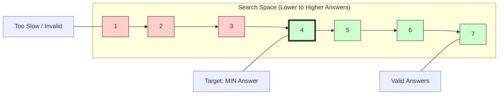
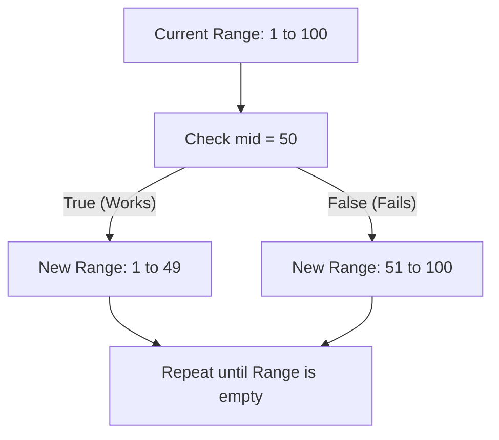

# Binary Search on Answer: The "Threshold" Pattern

When the problem asks for the **"Minimum $X$ to achieve $Y$"** or **"Maximum $X$ to satisfy $Y$"**, and as $X$ increases, the likelihood of satisfying $Y$ becomes strictly more (or less) certain, you are looking at **Binary Search on Answer**.

---

## 🧠 Mental Model: The "Speedometer" 🏎️

Imagine you are driving a car and trying to find the **Minimum Speed** required to arrive at your destination on time.

1.  **Too Slow?** You arrive late. (Invalid)
2.  **Too Fast?** You arrive early. (Valid, but maybe not the *minimum*).
3.  **The Sweet Spot:** There is a specific speed where you transition from "Late" to "On Time".

Binary Search is like a "Smart Radar" that keeps cutting the speed range in half until it pinpoints that exact transition point.

## 🖼️ Visual Illustration

### 1. The Monotonic Search Space
Binary Search on Answer only works if the search space is **monotonic**. This means once as you increase the answer, the result stays "True" (or "False") forever.



### 2. The Halving Process
At each step, we look at the `mid` point and eliminate half of the possibilities.



---

## ✨ Vivid Examples

### 1. The Banana Glutton (Koko Eating Bananas) 🍌
*   **The Question:** Minimum eating speed $K$ to finish all bananas within $H$ hours.
*   **The logic:** 
    *   Eating 1 banana/hour? Might take 100 hours (Too slow!).
    *   Eating 100 bananas/hour? Might take 2 hours (Valid, but too fast!).
    *   **The Binary Search:** Search through the "speeds".

### 2. The Bus Dispatcher (Min Time to Complete Trips) 🚌
*   **The Question:** Minimum time $T$ needed for a fleet of buses to finish $K$ trips.
*   **The logic:** 
    *   Give them 1 minute? Maybe only 1 trip finished.
    *   Give them 1,000,000 minutes? All trips finished long ago.
    *   **The Binary Search:** Search through the "time units".

### 3. The Social Distancing Cows (Aggressive Cows) 🐄
*   **The Question:** Maximum "minimum distance" between cows.
*   **The logic:** 
    *   Distance = 1? Easy to fit cows.
    *   Distance = 1,000,000? Impossible.
    *   **The Binary Search:** Search through the "distance gaps".

---

## 🛠️ The "Master Template" (Python)

```python
def solve(params):
    # 1. Define the search range [left, right]
    # left: Smallest possible answer
    # right: Largest possible answer (be generous!)
    left, right = min_possible, max_possible
    
    ans = right
    
    # 2. The Binary Search Loop
    while left <= right:
        mid = left + (right - left) // 2
        
        # 3. The "Judge" (Check Function)
        if check(mid):
            # If 'mid' works, try to find an even smaller/larger better answer
            ans = mid
            # For MINIMIZE: right = mid - 1
            # For MAXIMIZE: left = mid + 1
            right = mid - 1 
        else:
            # If 'mid' doesn't work, we must go faster/slower
            # For MINIMIZE: left = mid + 1
            # For MAXIMIZE: right = mid - 1
            left = mid + 1
            
    return ans

def check(guess):
    # This is the "Judge". 
    # Return True if 'guess' satisfies the problem's condition.
    # Usually involves a simple O(N) loop to simulate the process.
    count = 0
    for x in data:
        count += guess // x # Example for bus trips
    return count >= target
```

---

## 🌊 Floating-Point Binary Search (Continuous)

When the answer is a **floating-point number** (e.g., "Find the square root" or "Minimal radius"), the discrete `while left <= right` approach no longer applies. We need to narrow down a **range** rather than find an **integer index**.

### 🛠️ Floating-Point Template (Preferred: Iteration-based)
Instead of checking `right - left > 1e-9` (which can be risky Due to precision issues), the **Iteration-based** approach is more robust. 100 iterations will narrow the range by a factor of $2^{100} \approx 10^{30}$, which is far beyond standard `double` precision.

```python
def solve_float(params):
    left, right = min_possible, max_possible
    
    # Run a fixed number of iterations (e.g., 100)
    for _ in range(100):
        mid = (left + right) / 2
        
        if check(mid):
            # For MINIMIZE: right = mid
            # For MAXIMIZE: left = mid
            right = mid
        else:
            left = mid
            
    return left # or right, they are virtually identical now
```

---

## ⚖️ Integer vs. Floating-Point: Which to use?

| Feature | Integer Binary Search | Floating-Point Binary Search |
| :--- | :--- | :--- |
| **Answer Type** | Discrete (Int, Index, Count) | Continuous (Speed, Time, Radius) |
| **Loop Condition** | `while left <= right` | `for _ in range(100)` or `while r-l > eps` |
| **The Result** | Pinpoints exact index | Converges to a specific value |
| **Middle Point** | `mid = (l + r) // 2` (Integers) | `mid = (l + r) / 2.0` (Floats) |
| **Update Rule** | `left = mid + 1` or `right = mid - 1` | `left = mid` or `right = mid` |
| **Precision Bug** | Safe from precision issues | Risk of infinite loops if using epsilon |

### 🛑 When NOT to use Floating-Point Search
Even if the problem involves floats (like "reach the office on time = 2.7 hours"), if the **answer required** is an **integer** (like "find the minimum integer speed"), you should use **Integer Binary Search**. Using floats for integer answers is a common cause for **Time Limit Exceeded (TLE)** on LeetCode.

---

## 💡 Pro-Tips for Interviews

1.  **Identify the Monotonicity**: Ask yourself: "If $X$ works, does $X+1$ definitely work?" If yes, it's monotonic.
2.  **The "Judge" must be fast**: Usually $O(N)$. The total complexity will be $O(N \log (\text{Range}))$.
3.  **Boundary Check**: Start `right` with a value you are 100% sure works (e.g., `max(time) * totalTrips`).
4.  **🛑 Warning: Zero Division**: If your `check` function involves division (like `count // guess`), starting `left = 0` will cause a **ZeroDivisionError**. Always start `left = 1` and handle the `0` case as your initial `ans = 0`.
5.  **⚡ Pitfall: Integer vs Float Search**: If the problem asks for an **Integer** answer (e.g., "Minimum Speed", "Smallest Time"), binary search on the **Integers**. If you search on floats and then round at the end, you risk TLE or precision errors.
6.  **🛡️ Interview Tip: Simple vs. Over-optimized Bounds**: Don't waste time deriving complex formulas for `left` or `right` (e.g., `sum(dist)/hour`).
    - **Reason 1: Dimensional Accuracy**: Formulas like `sum/len` are often dimensionally wrong (Average Distance vs Speed).
    - **Reason 2: Logarithmic Speed**: Binary search is $O(\log R)$. The difference between searching from `1` to $10^9$ ($\approx 30$ steps) vs `1000` to $10^9$ ($\approx 20$ steps) is negligible.
    - **Reason 3: Safety**: Using `1` as a lower bound is "Interview Safe"—it's impossible to be wrong, whereas a complex formula might accidentally exclude the real answer.
