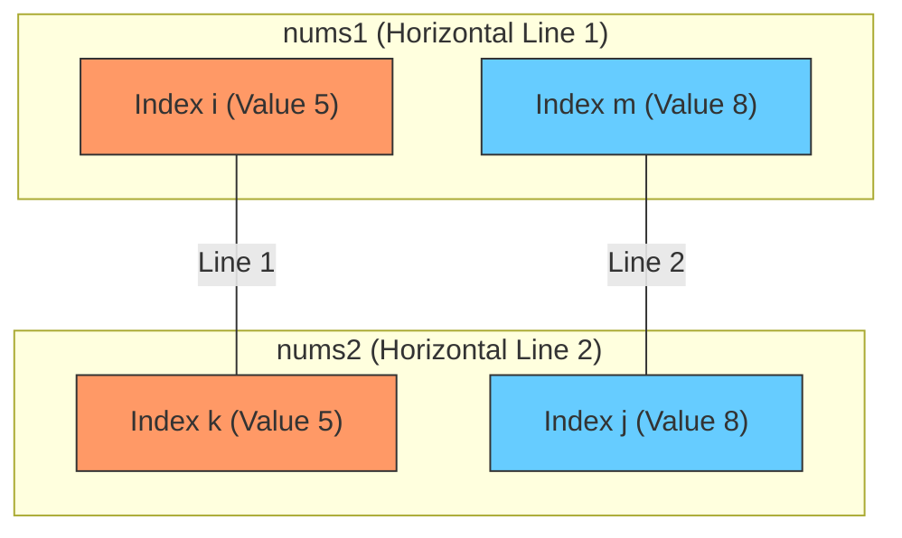

# 1035. Uncrossed Lines - Logic Explanation

The "Uncrossed Lines" problem is a classic application of **Dynamic Programming**, and it is mathematically identical to finding the **Longest Common Subsequence (LCS)** between two arrays. 

## The Intuition: Why LCS?
We can draw a line between `nums1[i]` and `nums2[j]` if they are equal. The "uncrossed" constraint means that if we connect index `i` to index `j`, any subsequent lines must connect an index `i' > i` to an index `j' > j`. This preservation of relative order is exactly what LCS measures.

## The Strategy: Working From the Ends
When comparing two arrays (or substrings) from the end, we encounter two main scenarios:

### 1. The Last Numbers Match (`nums1[i] == nums2[j]`)
If the last numbers are the same, we **definitely** draw a line between them. 
- **Why?** Drawing this line doesn't "cost" anything in terms of future lines. Since it's at the very end, it won't intersect any lines drawn between the remaining numbers to its left.
- **Action:** Add `1` to our total and move both pointers inward to solve the smaller subproblem: `1 + f(i-1, j-1)`.

---

### 2. The Last Numbers Mismatch (`nums1[i] != nums2[j]`)
If the last numbers don't match (e.g., `4` and `2`), we cannot draw a line between them. One (or both) of these numbers might be "useless" for our optimal configuration, or one might match a number further back in the other array.

To find the maximum possible lines, we explore two options:
1.  **Drop `nums1[i]`:** See how many lines we can get if we ignore the last element of the first array.
2.  **Drop `nums2[j]`:** See how many lines we can get if we ignore the last element of the second array.

We then take the **maximum** of these two results.

#### Concrete Example:
**Input:** `nums1 = [1, 2, 4]`, `nums2 = [4, 1, 2]`

Comparing the ends: `nums1` ends in **4**, `nums2` ends in **2**.  
Since **4 ≠ 2**, we branching:

*   **Option A (Drop the 4):** Compare `[1, 2]` and `[4, 1, 2]`.
    *   Now the ends match (**2 == 2**)! We draw a line and look at `[1]` and `[4, 1]`.
    *   Total lines found this way: **2** (connecting 2-2 and 1-1).
*   **Option B (Drop the 2):** Compare `[1, 2, 4]` and `[4, 1]`.
    *   Now the ends match (**4 == 4**)! We draw a line and look at `[1, 2]` and `[1]`.
    *   Total lines found this way: **1** (connecting 4-4).

**Final Decision:** `max(Option A, Option B) = max(2, 1) = 2`.

---

## The Recurrence Relation
If $f(i, j)$ is the maximum number of uncrossed lines for prefixes `nums1[0...i]` and `nums2[0...j]`:

```python
if nums1[i] == nums2[j]:
    # Match found: draw line and shrink both arrays
    dp[i][j] = 1 + f(i - 1, j - 1)
else:
    # Mismatch: skip one element from either nums1 or nums2
    dp[i][j] = max(f(i - 1, j), f(i, j - 1))
```

By checking both `f(i-1, j)` and `f(i, j-1)`, the algorithm ensures it doesn't "miss" a match that was hidden just one position away.

---

## Visual Proof: The Crossing Constraint

Why can't we use **both** mismatching endpoints in an optimal solution? 

Let's say `nums1` ends in **5** and `nums2` ends in **8** (a mismatch). If we insisted on using both, the lines would have to look like this:

### The "Crossing" Diagram


### Why they MUST cross:
| Array | Order In Array | Indices | Values |
| :--- | :--- | :--- | :--- |
| **nums1** | `8` comes before `5` | $m < i$ | $nums1[m]=8, nums1[i]=5$ |
| **nums2** | `5` comes before `8` | $k < j$ | $nums2[k]=5, nums2[j]=8$ |

As you can see:
1. To connect the **5s**, we go from the **end** of `nums1` back to an **earlier** part of `nums2`.
2. To connect the **8s**, we go from an **earlier** part of `nums1` forward to the **end** of `nums2`.

These two paths **geometrically must intersect**. Since intersections are illegal, the optimal solution can only contain **at most one** of these endpoints. This is why we split the problem into two sub-problems (dropping one vs. dropping the other) and take the maximum.

---

## FAQ: What if BOTH numbers should be dropped?

You might wonder: "If the options are to drop the last of `nums1` OR the last of `nums2`, what if the best move is to drop both?"

The recurrence `max(f(i-1, j), f(i, j-1))` **implicitly covers the 'drop both' case.**

### The Logic:
- `f(i-1, j)` explores all possibilities where `nums1[i]` is ignored. One of those possibilities is that `nums2[j]` is *also* ignored later in the recursion.
- `f(i, j-1)` explores all possibilities where `nums2[j]` is ignored. One of those possibilities is that `nums1[i]` is *also* ignored later in the recursion.

Mathematically, $f(i-1, j-1)$ is always less than or equal to both $f(i-1, j)$ and $f(i, j-1)$. Therefore, we don't need a third branch specifically for "drop both"—it is already captured within the other two.
