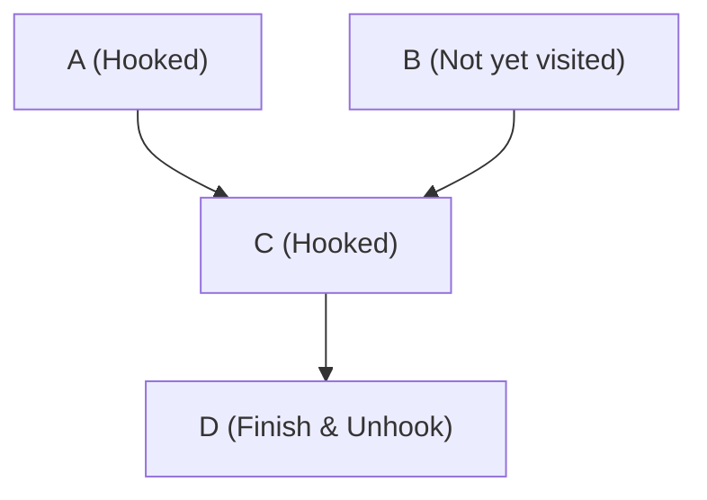

# 207. Course Schedule

## Problem Context
The goal is to determine if all courses can be finished given a set of prerequisites. This is equivalent to finding if a **Directed Cycle** exists in the graph of course dependencies.

## Cycle Detection Logic (DFS + Backtracking)

The solution uses Depth First Search (DFS) with an `on_path` set to track the current recursion path. This is a common pattern for detecting cycles in directed graphs.

### The "Red Pin" Analogy 🚩
Imagine exploring a series of one-way tunnels in a cave with a bag of **Red Pins**:

1. **`on_path.add(c)`**: When you enter course `c`, you stick a **Red Pin** on the wall. This marks that you are **currently investigating** this path.
2. **`on_path.remove(c)`**: Once you have explored all branches leading from `c` and confirmed they don't loop back, you **take your Red Pin back** as you leave. This marks the node as "finished" for the current exploration.

### 💡 Why `on_path.remove(c)` is Necessary?

Without removing the node from the `on_path` set, the algorithm would incorrectly detect cycles in "V-shaped" or Diamond-shaped graphs where two different paths meet at the same safe node.

#### Example: The V-Shape
- Course **A** needs **C** (`A -> C`)
- Course **B** needs **C** (`B -> C`)

| Step | Action | `on_path` set | Explanation |
| :--- | :--- | :--- | :--- |
| 1 | Visit **A** | `{A}` | |
| 2 | Visit **C** | `{A, C}` | |
| 3 | Finish **C** | `{A, C} -> {A}` | **`remove(C)`** allows future paths to visit C safely. |
| 4 | Finish **A** | `{A} -> {}` | |
| 5 | Visit **B** | `{B}` | |
| 6 | Visit **C** | `{B, C}` | **No loop!** Since C was removed from the set in Step 3. |

### The "Memoization-based Pruning" 🛡️
Why is `pre_map[c] = []` used after the loop?

- **The Proof**: For the `for` loop to finish, every dependency must have returned `True`. If there were a cycle, the function would have already exited with `return False`.
- **The Result**: If we reach the end of the `dfs` function, we have "stress-tested" every path starting from course `c`. We can now stamp it as **"Certified Safe"**.
- **The Benefit**: This prevents re-exploring the same safe sub-branches (e.g., in Diamond-shaped graphs), turning an exponential time complexity into linear $O(V + E)$.

## Optimized Implementation

```python
class Solution:
    def canFinish(self, numCourses: int, prerequisites: List[List[int]]) -> bool:
        pre_map = defaultdict(list)
        for crs, pre in prerequisites:
            pre_map[crs].append(pre)
        
        on_path = set()
        
        def dfs(c):
            if c in on_path: # Cycle detected!
                return False
            if pre_map[c] == []: # Already confirmed safe
                return True
            
            on_path.add(c)
            for pre in pre_map[c]:
                if not dfs(pre): # Check if sub-path is safe
                    return False
            
            on_path.remove(c)
            pre_map[c] = [] # OPTIMIZATION: Mark as safe for other paths
            return True
        
        for c in range(numCourses):
            if not dfs(c):
                return False
        return True
```

---

## Iterative DFS Version (Manual Stack)

The iterative version is slightly trickier because we must manually handle the **backtracking** step (knowing when we are finishing a node).

### The "State" Approach
Instead of a simple set, we use a `states` array to track the status of each node:
- **0 (UNVISITED)**: Not yet seen.
- **1 (VISITING)**: Currently in the recursion stack (the "Red Pin" is on).
- **2 (VISITED)**: Fully explored and confirmed safe ("Certified Safe" stamp).

### Implementation Logic
We push `(node, finished_status)` to our stack. 
1. When we first encounter a node (`finished_status = False`), we mark it as **VISITING**.
2. We push it back to the stack with `finished_status = True`.
3. We push all its neighbors.
4. When we pop a node with `finished_status = True`, it means all its neighbors have been processed. We mark it as **VISITED**.

```python
class Solution:
    def canFinish(self, numCourses: int, prerequisites: List[List[int]]) -> bool:
        pre_map = {i: [] for i in range(numCourses)}
        for crs, pre in prerequisites:
            pre_map[crs].append(pre)
            
        states = [0] * numCourses # 0=unvisited, 1=visiting, 2=visited
        
        for i in range(numCourses):
            if states[i] != 0: continue
            
            stack = [(i, False)]
            while stack:
                curr, processed = stack.pop()
                
                if processed:
                    states[curr] = 2 # Finished exploring all neighbors
                    continue
                
                if states[curr] == 1: return False # Cycle!
                if states[curr] == 2: continue     # Already safe
                
                states[curr] = 1 # Mark as VISITING
                stack.append((curr, True)) # Push back to mark VISITED later
                
                for neighbor in pre_map[curr]:
                    stack.append((neighbor, False))
                    
        return True
```

---

## BFS Version: Kahn's Algorithm (Topological Sort)

This is the "Leveling Up" approach. Instead of digging deep into paths (DFS), we look at the requirements from the bottom up.

### The "Unlocking" Analogy 🕹️
Imagine you are playing an RPG and need to unlock skills:
1.  **`indegree`**: This is the number of **locks** on a skill. If a skill has 3 prerequisites, it has 3 locks.
2.  **`seed_courses`**: These are the **Starter Skills** that have 0 locks. You can take them right away.
3.  **The Process**:
    *   Pick a Starter Skill and "finish" it.
    *   Look at all the "Advanced Skills" that required the skill you just finished.
    *   **Remove one lock** (`indegree -= 1`) from each of those skills.
    *   If an Advanced Skill now has **0 locks**, it becomes a new **Starter Skill**!

**The Win Condition**: If you eventually unlock every single skill in the game, you win (`len(seed_courses) == numCourses`). If you get stuck with skills still locked, there must be a "circular requirement" loop.

### Why this is clever (Pythonic BFS)
In your code, you use a list as a queue:
```python
seed_courses = [...] # Initial 0-indegree nodes
for seed_course in seed_courses: # Python keeps iterating as you append!
    # ... process neighbors ...
    if indegree[sub_course] == 0:
        seed_courses.append(sub_course)
```
This is a very efficient trick! Because Python’s `for` loop tracks the index, appending to the same list while iterating over it acts exactly like a **Queue**, without needing `collections.deque`.

### Implementation
```python
class Solution:
    def canFinish(self, numCourses: int, prerequisites: List[List[int]]) -> bool:
        pre_to_course = {i: [] for i in range(numCourses)}
        indegree = {i: 0 for i in range(numCourses)}
        
        for course, pre in prerequisites:
            pre_to_course[pre].append(course)
            indegree[course] += 1
            
        # 1. Start with courses that have 0 prerequisites
        seed_courses = [c for c, degree in indegree.items() if degree == 0]
        
        # 2. "Unlock" courses one by one
        for seed_course in seed_courses:
            for sub_course in pre_to_course[seed_course]:
                indegree[sub_course] -= 1
                if indegree[sub_course] == 0:
                    seed_courses.append(sub_course)
                    
        # 3. If we visited every course, no cycle exists
        return len(seed_courses) == numCourses
```

### High-Performance Optimization (The "Pro" Version) 🏎️
For maximum speed in Python, you can swap **Dictionaries** for **Lists**. Since our courses are numbered $0$ to $N-1$, we can use the index directly.

1.  **List vs Dictionary**: Indexing into a list (`L[i]`) is significantly faster than a hash map lookup (`D[i]`).
2.  **Initialization**: `[0] * n` is the fastest way in Python to create a pre-filled array.

```python
class Solution:
    def canFinish(self, numCourses: int, prerequisites: List[List[int]]) -> bool:
        # Optimization 1: Use Lists instead of Dictionaries for O(1) indexing
        adj = [[] for _ in range(numCourses)]
        indegree = [0] * numCourses
        
        for crs, pre in prerequisites:
            adj[pre].append(crs)
            indegree[crs] += 1
            
        # Optimization 2: Use a counter instead of storing a result list
        queue = [i for i in range(numCourses) if indegree[i] == 0]
        count = 0 
        
        # Optimization 3: The "Pythonic Queue" (Iterating while appending)
        for node in queue:
            count += 1
            for neighbor in adj[node]:
                indegree[neighbor] -= 1
                if indegree[neighbor] == 0:
                    queue.append(neighbor)
                    
        return count == numCourses
```

---

## 🏎️ Performance Battle: DFS vs BFS

You might notice that **DFS is often faster** than BFS (Kahn's) on LeetCode. Here is why:

### 1. The "Early Exit" Advantage (DFS Win)
*   **DFS**: As soon as DFS hits a cycle, it immediately returns `False` and stops everything.
*   **BFS**: Kahn's algorithm generally has to process a large portion of the graph before it "realizes" it's stuck in a cycle. It doesn't have a "stop early" button as effective as DFS's.

### 2. Initialization Overhead
*   **DFS**: Only needs the adjacency list.
*   **BFS**: Needs the adjacency list **AND** the `indegree` array. Building that second `indegree` structure takes extra time and memory.

### 3. Sparse vs Dense Graphs
*   If the graph has very few prerequisites, DFS might only explore a tiny "island" of the graph. BFS (Kahn's) still has to initialize the `indegree` for **every** single course from $0$ to $N-1$, which is $O(N)$ overhead even if there are 0 prerequisites.

### Which one should I use?
*   **Interview**: Use **DFS**. It's shorter to write and the "Early Exit" is a great talking point for optimization.
*   **Production**: Use **BFS**. It prevents "Recursion Depth" crashes on massive datasets and is more robust for actual Topological Sorting (like build systems or package managers).

---

## Standard DFS vs. DFS with Backtracking 🔍

A common question is: **"Is `visited.remove()` always necessary in DFS?"**

The answer depends on your goal:

| Feature | Standard DFS Traversal | DFS with Backtracking (Cycle Detection) |
| :--- | :--- | :--- |
| **Logic** | "Have I ever been here before?" | "Am I currently pathfinding through this node?" |
| **`on_path.add()`** | ✅ Necessary (prevents infinite loops). | ✅ Necessary (starts the path tracking). |
| **`on_path.remove()`** | ❌ **Not used.** | ✅ **Essential.** |
| **Set Meaning** | Global history of all visited nodes. | Current "Recursion Stack" (the path we are on). |
| **Analogy** | Checking off rooms you've already painted. | Sticking a "Red Pin" in rooms on your current walk. |

### The "Breadcrumb" vs. "String" Logic 🐚

To understand why `remove()` is the magic ingredient, compare these two physical models:

#### 1. Standard DFS: "The Painted Room" (Global Set)
You are painting every room you enter. If you walk into a room and the walls are already blue, you say *"I've been here before"* and turn around. 
- **The Problem**: In a V-shaped graph (`A -> C`, `B -> C`), you'd paint `C` while walking from `A`. When you later walk from `B` to `C`, you see the blue paint and falsely assume you've found a cycle.

#### 2. Backtracking: "The Tied String" (Path Set)
You walk into the maze with a single long string tied to your waist. 
- **`on_path.add(c)`**: You clip the string to a hook as you enter a room.
- **`c in on_path`**: If you enter a room and see your **own string** already hooked there, you’ve walked in a circle!
- **`on_path.remove(c)`**: When you backtrack/leave a room, you **unhook the string**.



By unhooking the string as you leave, you ensure that if another path (like `B`) reaches `C` later, it doesn't get confused by your previous footprints. **You only care if you are currently "standing" in that room as part of your active path.**
