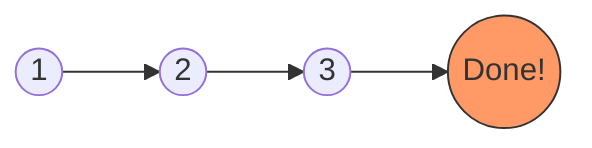
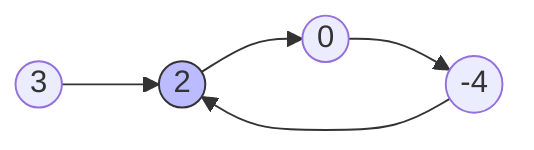

# 141. Linked List Cycle - The Tortoise and the Hare 🐢 vs 🐇

Identifying a cycle in a linked list is like checking if a race track is a **straight line** or a **circular loop** without being able to see the whole track at once.

## 🏁 The Analogy: The Race on a Track

Imagine two runners, a **Tortoise** and a **Hare**, starting at the beginning of a track.

- **The Tortoise (Slow 🐢)**: Moves 1 step at a time.
- **The Hare (Fast 🐇)**: Moves 2 steps at a time.

### Scenario A: A Straight Path (No Cycle)
If the track is just a straight line, the fast Hare will eventually reach the finish line (the end of the list where `next` is `None`) and leave the Tortoise behind.



### Scenario B: A Circular Track (Cycle)
If the track loops back on itself, the Hare will eventually "lap" the Tortoise. Because the Hare is moving faster, the distance between them shrinks by 1 step every turn until they eventually **land on the exact same spot**.



---

## 🛠️ Step-by-Step Intuition

### Example: `[3, 2, 0, -4]` with cycle at index 1

| Move | Tortoise (Slow) | Hare (Fast) | Distance (Steps apart) |
| :--- | :--- | :--- | :--- |
| **Start** | index 0 (val 3) | index 0 (val 3) | 0 |
| **1st** | index 1 (val 2) | index 2 (val 0) | 1 |
| **2nd** | index 2 (val 0) | **Back to** index 1 (val 2) | 1 |
| **3rd** | index 3 (val -4) | index 3 (val -4) | **0 (Met!)** |

> [!TIP]
> If they ever meet, it **must** be because there's a loop. In a straight list, the distance between them would only ever increase.

---

## 💻 Implementation Logic (O(1) Memory)

```python
def hasCycle(head):
    slow, fast = head, head
    
    while fast and fast.next:
        slow = slow.next          # 1 step
        fast = fast.next.next     # 2 steps
        
        if slow == fast:          # They met!
            return True
            
    return False                  # Hare reached the end
```

## 📊 Complexity Analysis

- **Time Complexity**: $O(N)$
  - If no cycle, the Hare reaches the end in $N/2$ steps.
  - If there is a cycle, the Hare will lap the Tortoise in at most one full trip around the loop once the Tortoise enters it.
- **Space Complexity**: $O(1)$
  - We only use two pointers (`slow` and `fast`), regardless of how large the list is.

---

## 💡 Key Takeaway
This is called **Floyd's Cycle-Finding Algorithm**. It's the most efficient way to detect loops because it avoids storing visited nodes in a Set, which would take $O(N)$ extra space.
