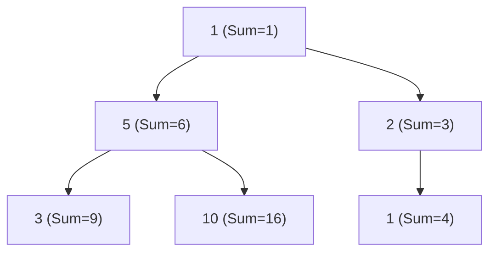

# LeetCode 1080: Insufficient Nodes in Root to Leaf Paths

## 🏰 The Quest for the Golden Exit

Imagine you are an adventurer in a branching dungeon. Each room has a value (gold or a trap). You start at the entrance (**Root**) and want to reach any of the escapes (**Leaves**).

However, there's a catch: you have a **Limit**. You only survive if the total sum of values on your path from the entrance to an escape is at least the `limit`.

### What is an "Insufficient Node"?
A room is **insufficient** if **every single path** passing through it fails to reach the limit. If a room gives you no hope of surviving, it might as well not exist! We seal off these rooms.

---

## 🛠️ The Strategy: Post-Order Traversal

We use a "Bottom-Up" approach (Post-Order Traversal) to decide which rooms to keep.

1.  **Exploration (DFS):** We dive deep into the dungeon, carrying our current treasure sum.
2.  **The Leaf Decision:** Once we hit an escape (a leaf node), we check if our total gold is enough ($sum \ge limit$). 
    - If yes, the escape is valid (keep the node).
    - If no, the escape is a dead end (return `None`).
3.  **The Return Journey (Pruning):** As we climb back up from the escapes:
    - We check our children. If a child didn't lead to a valid escape, we remove that connection (`node.left = None` or `node.right = None`).
    - **Crucial Rule:** If a room now has **no children** (meaning all its paths were dead ends), and it wasn't a valid escape itself, then this room is now a dead end too! We return `None` to the room above.

---

## 🎨 Vivid Example

**Limit = 10**



1.  **Node D (Leaf):** Total path sum $1+5+3 = 9$. Since $9 < 10$, D is insufficient. **Delete D.**
2.  **Node E (Leaf):** Total path sum $1+5+10 = 16$. Since $16 \ge 10$, E is sufficient. **Keep E.**
3.  **Node B:** B's left child (D) was deleted, but B's right child (E) is still there. B has at least one valid path. **Keep B.**
4.  **Node F (Leaf):** Total path sum $1+2+1 = 4$. Since $4 < 10$, F is insufficient. **Delete F.**
5.  **Node C:** C's only child (F) was deleted. Now C has no children and isn't a leaf that met the limit. **Delete C.**
6.  **Node A:** A's right child (C) was deleted, but A's left child (B) is still there. **Keep A.**

**Final Tree:** A -> B -> E.

---

## 💻 Python Implementation

```python
class Solution:
    def sufficientSubset(self, root: Optional[TreeNode], limit: int) -> Optional[TreeNode]:
        def dfs(node, current_sum):
            if not node:
                return None
            
            # Update current sum with this node's value
            current_sum += node.val
            
            # Base Case: It's a leaf node
            if not node.left and not node.right:
                return node if current_sum >= limit else None
            
            # Recursive Step: Check children
            node.left = dfs(node.left, current_sum)
            node.right = dfs(node.right, current_sum)
            
            # If both children are gone, this node becomes "insufficient"
            # (Because it's no longer a leaf and has no valid children)
            if not node.left and not node.right:
                return None
            
            return node
            
        return dfs(root, 0)
```

---

## 🧠 The Anatomy of Elegance: Design Thinking

The **elegance** of this solution comes from splitting the work between **Top-Down information** and **Bottom-Up decision making**.

### 1. What does the child need to know? (Input Args)
To know if a path is sufficient, a leaf must know the total sum from the entrance (root).
- **Direction:** **Top-Down**.
- **The Value:** Pass `current_sum` as an argument.
- **Why it works:** By passing it down, each node "remembers" the path taken to reach it. It keeps the state local and prevents the need for any global variables.

### 2. What does the parent need to know? (Return Value)
After a child explores its branch, it must report back: *"Am I still a valid path, or should you prune me?"*
- **Direction:** **Bottom-Up**.
- **The Value:** Return `Optional[TreeNode]` (`node` or `None`).
- **Why it works:** This allows the parent to decide whether to keep the child or "sever the link" based on the child's findings.

### 🎯 Putting it together: The "Pruning" Pattern
The most elegant part is how the return value is used by the parent:
```python
node.left = dfs(node.left, current_sum)
node.right = dfs(node.right, current_sum)
```
Instead of writing complex logic like `if child is bad: del child`, we simply **re-assign** the child pointers. If `dfs` returns `None`, the link is automatically severed. This is the "Standard Pruning Pattern" in tree algorithms.

---

## ✂️ The "Standard Pruning Pattern"

In tree algorithms, "Pruning" refers to removing subtrees that don't meet certain criteria. The most elegant way to do this in Python (and many other languages) is the **Re-assignment Pattern**.

### How it Works
Instead of having a parent "look down" and decide whether to delete a child, we let the child "decide its own fate" and report back to the parent.

```python
# The Core Pattern
node.left = self.prune(node.left)
node.right = self.prune(node.right)
```

### Why is this "Standard"?
1.  **Implicit Deletion:** By re-assigning `node.left` to the result of the function, if the function returns `None`, the link is severed automatically. Python's garbage collector then reclaims the memory of the unreachable subtree.
2.  **Depth-First naturally:** This pattern fits perfectly with Post-Order Traversal. We prune from the leaves up to the root.
3.  **Cleaner Logic:** It avoids messy `if` checks or manual deletions.
    - **Messy way:** `if should_delete_left: node.left = None`
    - **Elegant way:** `node.left = dfs(node.left)`

### Other Common Use Cases
You'll see this pattern everywhere in tree problems:
- **LeetCode 814 (Binary Tree Pruning):** Remove subtrees that don't contain a `1`.
- **LeetCode 450 (Delete Node in a BST):** When you delete a node, you return the "new" version of that subtree to the parent.
- **BST Construction:** When inserting or deleting in a balanced tree (like an AVL or Red-Black tree), we often use `node.left = insert(node.left, val)` to handle rotations naturally.

---

## 🌉 The "Bridge" Analogy: Why Prune Internal Nodes?

You asked about this specific logic:
```python
if not node.left and not node.right:
    return None
```

This is the most subtle part of the problem. Why do we delete a node just because its children are gone?

### The Definition
The problem says: *"A node is insufficient if **every** root-to-leaf path intersecting this node has a sum strictly less than limit."*

### The Analogy
Imagine the node is a **room** in our dungeon, and its children are **bridges** (paths) leading to the exits (leaves).

1.  **Original Leaf:** If you are in a room that is already an exit (no bridges), you just check if you have enough gold.
2.  **Internal Node:** If you are in a room with two bridges (Left and Right):
    - You send scouts down both bridges.
    - The scouts report back: *"Both bridges lead to certain death! I've destroyed them so no one else goes that way."* (`node.left = None` and `node.right = None`)
3.  **The Conclusion:** Now you are standing in a room with **no bridges left**. Since every path through your room *had* to go through one of those two bridges, and both are now gone, there is now **zero hope** of reaching a valid exit through your room.

### ⚠️ The "New Leaf" Trap
We only trigger this logic **after** we've tried to prune the children. 
- If a node *started* as a leaf, it was handled by the `Base Case`.
- If a node *becomes* a leaf (because its children were insufficient), it means those children failed to provide a sufficient path. Therefore, the node itself has failed.

**Final Rule:** In this problem, an internal node is only as "sufficient" as the paths it leads to. If it leads nowhere good, it has no reason to exist!

---

## 📖 The Math Decoder: Translating the Proof

The formal notation used in the proof can be translated into plain English:

### The Symbols
| Symbol | Meaning |
| :--- | :--- |
| $\forall$ | **"For every single..."** (The "Universal Quantifier") |
| $P$ | **A path.** |
| $\in$ | **"that exists inside the set..."** (Element of) |
| $\mathcal{P}(v_{left})$ | **The set of all paths through the left child.** |
| $\mathcal{S}(P)$ | **The total sum of path $P$.** |

### The Translation
If we put it all together, the statement:
$$\forall P \in \mathcal{P}(v_{left}), \mathcal{S}(P) < limit$$

**Translates to:**
> "For **every single path** that passes through the **left child**, the **sum** of those nodes is **less than the limit**."

In other words: **"Every single path leading from the left child is a dead end."**

When we prove that this is true for *both* the left child and the right child, we prove that *every* possible path through the current node must also be a dead end!

---

## 🧮 The Mathematical Proof: Exhaustive Insufficiency

Let’s prove why an internal node $u$ must be pruned if its children $v_{left}$ and $v_{right}$ are pruned.

### 1. Definitions
*   Let $\mathcal{P}(u)$ be the set of all root-to-leaf paths passing through node $u$.
*   Let $\mathcal{S}(P)$ be the sum of values of all nodes in path $P$.
*   **Definition of Sufficiency:** Node $u$ is sufficient iff $\exists P \in \mathcal{P}(u)$ such that $\mathcal{S}(P) \ge limit$.

### 2. The Partition
For any internal (non-leaf) node $u$, every path through $u$ must go through one of its children. Therefore, we can partition the set $\mathcal{P}(u)$ into two subsets:
$$\mathcal{P}(u) = \mathcal{P}(v_{left}) \cup \mathcal{P}(v_{right})$$
*(Where $\mathcal{P}(v_{left})$ is the set of paths passing through the left child, etc.)*

### 3. The Condition of "Pruned Children"
If the recursive call for $v_{left}$ returned `None`, it means $v_{left}$ was found to be insufficient. By definition:
$$\forall P \in \mathcal{P}(v_{left}), \mathcal{S}(P) < limit$$
Similarly, if $v_{right}$ was also pruned:
$$\forall P \in \mathcal{P}(v_{right}), \mathcal{S}(P) < limit$$

### 4. The Conclusion
Since every path in $\mathcal{P}(u)$ belongs to either $\mathcal{P}(v_{left})$ or $\mathcal{P}(v_{right})$, and we've shown that every path in both of those subsets has a sum less than the limit, then:
$$\forall P \in \mathcal{P}(u), \mathcal{S}(P) < limit$$

By the **Definition of Sufficiency**, node $u$ has no path that meets the limit. Therefore, node $u$ is mathematically guaranteed to be insufficient and **must be pruned**.

---

## 🛡️ The "Survival is Proof" Principle

You asked: *"Why don't we re-check `current_sum >= limit` for internal nodes?"*

This is a great observation. It feels like we should be double-checking everywhere, but it turns out to be **mathematically redundant**.

### 1. The Child is the Witness
An internal node only cares about one thing: **"Does a valid path exist through me?"**
- If a child node survives the `dfs` call, it is a **living witness** that at least one path through that child reached a leaf with a total sum $\ge limit$.
- Since that path also passes through the current node, the current node is "saved" by its child.

### 2. The Internal Sum is Incomplete
Checking `current_sum >= limit` at an internal node is actually **dangerous**:
- **Case A (False Negative):** An internal node might have `current_sum < limit`, but its children might have positive values that eventually push the total above the limit at the leaf. If we deleted the node early, we'd lose a valid path.
- **Case B (False Positive):** An internal node might have `current_sum >= limit`, but all its children might have massive negative values that push every path below the limit by the time they reach a leaf. 

### 3. Trust the Recursion
In our code:
1.  **Leaves** are the only ones that know the absolute truth (they are the end of the journey).
2.  **Internal nodes** simply delegate the truth-finding to their children.
    - If a child says "I found a way!" (returns a node), the internal node is sufficient.
    - If ALL children say "It's all dead ends!" (return `None`), only then is the internal node insufficient.

**Conclusion:** We don't need to re-check the math because the **existence** of a child is the only proof an internal node needs to know it has fulfilled its purpose.
